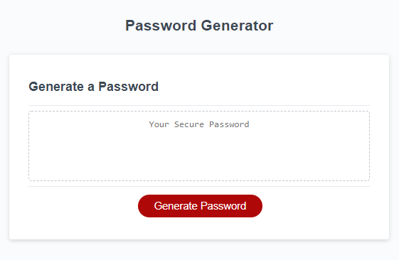

# Password-Generator

This app will provide a user with a randomly generated password of a desired length. The user also has the choice of character types to include in their password. They can choose from of the following types: uppercase, lowercase, numbers, and symbols.

Deployed application:
https://shelleymcq.github.io/Password-Generator/
